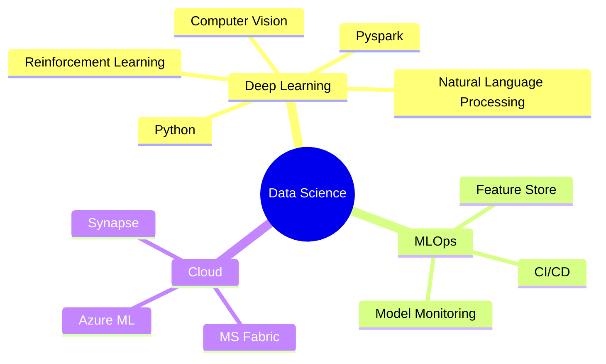

<div align="center">

<!-- ASCII Art Header -->
```
 ____  _               _                 _     
/ ___|| |__   __ _ ___| |__   __ _ _ __| | __ 
\___ \| '_ \ / _` / __| '_ \ / _` | '__| |/ / 
 ___) | | | | (_| \__ \ | | | (_| | |  |   <  
|____/|_| |_|\__,_|___/_| |_|\__,_|_|  |_|\_\ 
```

<!-- Animated Text -->
[](https://git.io/typing-svg)

<!-- Dynamic Badges Row 1 -->

[](https://badges.pufler.dev)
[](https://badges.pufler.dev)
[](https://badges.pufler.dev)

<!-- Dynamic Badges Row 2 -->
[](https://www.linkedin.com/in/shashankchhoker07/)
[](https://www.kaggle.com/shashankchhoker)
[](https://leetcode.com/jushank01/)
[](https://shashank975.github.io)

</div>

<!-- About Me Section -->
<div align="center">
<h2> 🤖 About Me </h2>
</div>

```python
#!/usr/bin/python
# -*- coding: utf-8 -*-

class DataScientist:
    def __init__(self):
        self.name = "Shashank Chhoker"
        self.role = "Data Scientist & ML Engineer"
        self.location = "🇮🇳 India"
        self.languages = ["en_US", "hi_IN"]
        self.education = {
            "degrees": ["Bachelor's in Computer Science"],
            "certifications": ["AWS ML Specialist", "Azure AI Engineer", "MS fabric", "MS Purview"]
        }
        self.skills = {
            "languages": ["Python","SQL","Pyspark"],
            "ml_frameworks": ["TensorFlow", "PyTorch", "Scikit-learn", "XGBoost"],
            "data_processing": ["Pandas", "NumPy", "PySpark", "Dask"],
            "visualization": ["Matplotlib", "Seaborn", "Plotly", "D3.js"],
            "cloud": ["AWS", "Azure", "GCP"],
            "mlops": ["Docker", "MLflow", "DVC"],
            "databases": ["PostgreSQL", "MongoDB", "Cassandra", "Redis"]
        }
        self.interests = ["Deep Learning", "Computer Vision", "NLP", "MLOps"]
        
    def say_hi(self):
        print("Thanks for visiting my profile! Let's collaborate and build something amazing! 🚀")

me = DataScientist()
me.say_hi()
```

<!-- Skill Bars -->
<div align="center">
<h2> 🛠️ Skills & Technologies </h2>
</div>

<!-- Data Science -->
    

<!-- Data Engineering -->
  

<!-- Cloud & MLOps -->
  

<!-- Development Tools -->
  

<!-- Statistics Section -->
<div align="center">
<h2> 📊 GitHub Statistics </h2>


<!-- Language Stats -->


<!-- Streak Stats -->


</div>

<!-- Contribution Graph -->
<div align="center">
<h2> 🏆 Achievements & Contributions </h2>

[](https://github.com/ryo-ma/github-profile-trophy)

<!-- Activity Graph -->
[](https://github.com/ashutosh00710/github-readme-activity-graph)

</div>

<!-- Current Focus Section -->
<div align="center">
<h2> 🎯 Current Focus </h2>
</div>



<!-- Latest Projects Section -->
<div align="center">
<h2> 🚀 Featured Projects </h2>


</div>


### 🎵 Now Playing
[](https://open.spotify.com/user/USER_NAME)

</div>

---

<div align="center">
  
</div>
